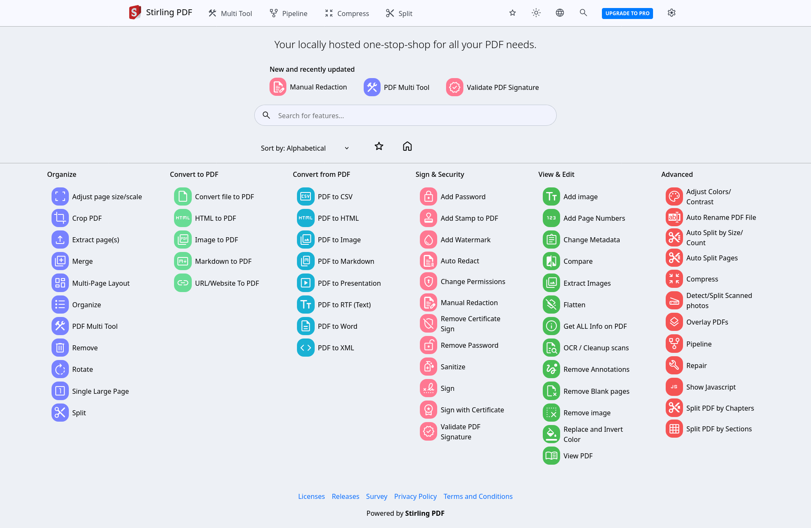
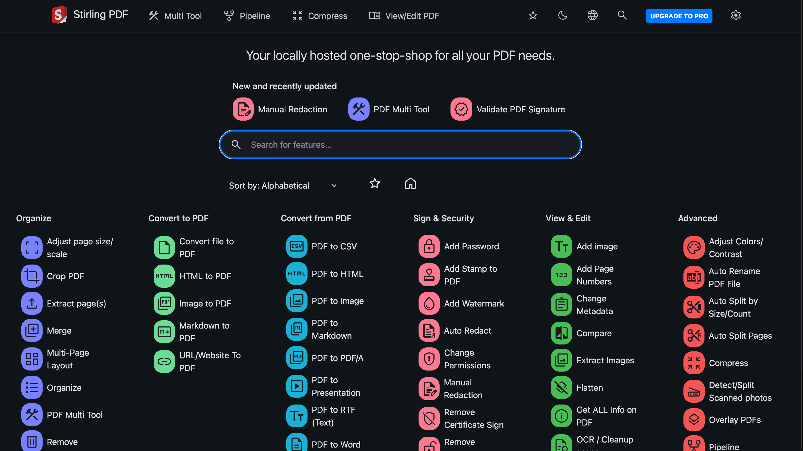
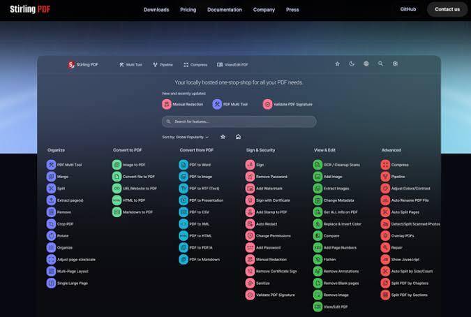

# Opensource PDF Editor

Opensource PDF Editor is Stirling PDF: a local PDF platform you run on a desktop, in a browser, or on your own server. A stirling pdf editor merge, split, sign, redact, convert, OCR, and compresses files without sending them to a public cloud.

This page is the handbook for that product. It covers Stirling PDF as an open source pdf editor, stirling pdf windows installers, and a self-hosted Docker or Java jar. A neighbor tree in this pack (BentoPDF) is the same class: a privacy-first toolkit that processes PDFs in the browser.

## Key Capabilities

Stirling PDF works where you already sit: a desktop client, a browser UI, and a self-hosted server with a private API.

The stirling pdf editor ships 50+ tools. Edit, merge, split, sign, redact, convert, OCR, and compress. Automation uses no-code pipelines in the UI and the same operations over REST. Paid on-prem seats add SSO and audit. The UI is translated into 40+ languages.

The neighbor toolkit lists the same jobs without a required server: no upload quota, and the file stays in the tab. Use both when you compare an open source pdf editor that is local-first.

Tool names live in [pdf-tools.ts](FILES/config/pdf-tools.ts). The Java process starts in [SPDFApplication.java](FILES/java/SPDFApplication.java).

## Why BentoPDF?

The neighbor answers four product questions that also apply to Stirling PDF.

Privacy first: processing stays in the browser or on your host. Files are not sent to a third party unless you choose that.

No limits: merge or split as often as you need. There is no daily upload cap on a self-hosted box.

High performance: modern web code and a Java backend handle large PDFs. Compress and OCR cost CPU, not a SaaS meter.

Completely free for the community builds. Stirling PDF Community and the AGPL neighbor are free. Paid editions buy team and enterprise extras.

## Features / Tools Supported

Both trees cover organize, edit, convert, secure, and automate. The desktop and server UI for Stirling PDF shows the same groups. The browser neighbor lists each tool in a grid.

### Organize and Manage PDFs

| Tool | What it does |
| --- | --- |
| Merge PDFs | Combine files. Bookmarks can stay. |
| Split PDFs | Extract pages or cut at a page list. |
| Organize pages | Reorder, duplicate, or delete with drag and drop. |
| Extract / delete / rotate | Save a range, drop pages, or rotate by 90 or a custom angle. |
| N-Up / booklet / posterize | Many pages on one sheet, booklet order, or print tiles. |
| Alternate and mix | Interleave pages from two PDFs. |
| Attachments | Add, extract, or edit embedded files. |
| Compare | Two PDFs side by side. |

Merge and split pages in the neighbor sit in [alternate-merge-page.ts](FILES/logic/alternate-merge-page.ts).

### Edit and Modify PDFs

The PDF editor annotates, highlights, redacts, comments, and adds shapes or images. Text edit reuses embedded fonts. Forms can be created or filled, including XFA on the neighbor. Page numbers, Bates numbers, watermarks, headers, crop, deskew, flatten, bookmarks, and stamps sit in the same group.

Watermark UI on the Stirling side is [AddWatermark.tsx](FILES/tools/AddWatermark.tsx). The canvas editor on the neighbor is [canvasEditor.ts](FILES/editor/canvasEditor.ts).

### Automate

Stirling PDF pipelines classify, standardize, route, and redact. The neighbor ships a visual node editor. Pipeline nodes live in [engine.ts](FILES/workflow/engine.ts).

### Convert to PDF

Image, office, ebook, and text formats become PDF.

| Source | Notes |
| --- | --- |
| JPG, PNG, WebP, SVG, BMP, HEIC, TIFF, PSD | Raster and vector stills, including JPEG2000. |
| Word, Excel, PowerPoint | DOC, DOCX, XLS, XLSX, PPT, PPTX. |
| ODT, ODS, ODP, ODG, RTF, CSV | OpenDocument and plain office. |
| Markdown, text, JSON, XML | Write or paste, then export. |
| EPUB, MOBI, FB2, CBZ | Ebooks and comics. |
| XPS, EML, MSG, Pages, WPD, WPS, PUB, VSD | Mail, Apple Pages, WordPerfect, Publisher, Visio. |

### Convert from PDF

PDF pages become JPG, PNG, WebP, BMP, TIFF, SVG, or CBZ. Text, JSON, CSV, and Excel come from extract and table tools. Greyscale flattens color. OCR makes a scan searchable and copyable. Stirling PDF uses host OCR when you enable it. The neighbor loads Tesseract language packs at runtime when OCR is on.

### Secure and Optimize PDFs

| Tool | What it does |
| --- | --- |
| Compress | Shrink size and keep a usable page. See [compress.ts](FILES/utils/compress.ts). |
| Repair | Recover a broken file when possible. |
| Encrypt / decrypt | Password protect or unlock (password required). |
| Permissions | Printing, copying, editing flags. |
| Sign / digital signature | Draw, type, upload, or use an X.509 cert. |
| Redact | Remove sensitive pixels and text. |
| Metadata | View, edit, or strip. |
| Sanitize / linearize | Drop scripts and speed web view. |

Password UI on Stirling is [AddPassword.tsx](FILES/tools/AddPassword.tsx). Signing calls go through [signing.ts](FILES/api/signing.ts).

## Licensing

Stirling PDF is open-core. Community is free. Team and enterprise are paid self-hosted or managed plans.

The neighbor is dual licensed. AGPL-3.0 for public source. A commercial seat for closed apps.

| License | Best for | Cost |
| --- | --- | --- |
| Stirling PDF Community | Personal use and learning | Free |
| Stirling PDF Team / Enterprise | SSO, audit, managed host | Paid |
| Neighbor AGPL-3.0 | Public source deployments | Free |
| Neighbor commercial | Closed source products | Paid lifetime seat |

WASM helpers the neighbor loads at runtime (PyMuPDF, Ghostscript, CoherentPDF) stay on a CDN unless you air-gap them. Stirling PDF Community does not pull those CDNs; it uses the Java stack and optional OCR tools on the host.

## Documentation

Stirling PDF docs cover desktop, Docker, Kubernetes, and the API. The neighbor docs cover Getting Started, a tools reference, and self-hosting on Docker, Vercel, Netlify, Cloudflare, AWS, Nginx, and Apache.

This pack keeps the files that matter next to the README. API calls from the UI go through [apiClient.ts](FILES/services/apiClient.ts). The browser entry is [main.ts](FILES/ui/main.ts).

## Translations

Stirling PDF UI is available in 40+ languages. The neighbor ships English, Chinese, Traditional Chinese, French, German, Indonesian, Italian, Portuguese, Turkish, Vietnamese, Korean, and Russian. Add a locale through the translation guide in each upstream tree.

## Getting Started

### Prerequisites

Node.js 18 or newer and npm, yarn, or pnpm for the web neighbor. Docker and Docker Compose for containers. A JDK for the Stirling PDF jar and `task` for the monorepo commands.

### Quick Start

Stirling PDF:

    docker run -p 8080:8080 docker.stirlingpdf.com/stirlingtools/stirling-pdf

Then open http://localhost:8080

Neighbor self-hosted image:

    docker run -p 3000:8080 ghcr.io/alam00000/bentopdf-simple:latest

Then open http://localhost:3000

The self-hosted neighbor image is the full tool set without marketing pages. The commercial image is the public site. If you only want tools, pull the self-hosted tag.

A compose file from the Stirling tree is [compose.yml](FILES/docker/compose.yml). Ultra-lite and fat images exist next to the default: fewer tools versus extra fonts and libraries. Desktop and Kubernetes steps are in the upstream docs, not a second download block here.

After Docker is up, drop a PDF on the home grid and run merge or compress before you turn on login. Keep `/configs` mounted if you want settings to survive a recreate.

### Static Hosting

The neighbor build is static files. Host `dist` on Netlify, Vercel, or GitHub Pages. Set `BASE_URL` if the app is not at `/`.

### Self-Hosting Locally

Extract a release, serve the folder, or clone, install, and build:

    npm install
    npm run build
    npm run preview

Preview listens on http://localhost:4173/ by default.

### Docker Compose / Podman Compose

Use the compose file in this pack or the upstream file. Podman Compose works with the same YAML. Quadlet units can pin the image under systemd if you run Podman on a server.

### Self-Hosted build and Commercial Build

Simple mode drops the hero, FAQ, and footer. Commercial mode keeps the marketing chrome. Stirling PDF editions are Community versus paid, not these two image tags.

### Custom Branding and disabled tools

The neighbor accepts brand assets and a list of tools to hide. Stirling PDF theming and endpoint flags live in server config. Do not expose write tools on a public host without login.

### Security Features

Run the container as a non-root user when you can. Set a custom port. Enable login on Stirling PDF before you publish the port. Keep PDF tools on a private network.

### Digital Signature CORS Proxy

Browser signing hits a certificate or timestamp URL that may block CORS. The neighbor expects a small proxy in front of those hosts. Stirling PDF signing stays on the Java API, so the desktop and server builds do not need that Worker. HMAC and rate limit flags on the neighbor are optional.

### Version Management

Neighbor releases are `patch`, `minor`, or `major` npm scripts. Stirling PDF versions are the jar, MSI, DMG, or image tag you pull.

Pin the tag in compose so a recreate does not jump a major.

### Development Setup

`task dev` starts the Stirling PDF editor. `task` lists common commands. For the neighbor, `npm run dev` or a Docker Compose dev file. Change one tool, run that package test, then the app.

Gzip, Brotli, or no compression are build flags on the neighbor image. All three is the default for browser compatibility. SIMPLE_MODE and BASE_URL can be set together when the app lives under a subpath such as `/tools/bentopdf/`.

Version bumps on the neighbor are patch, minor, or major npm scripts. Stirling PDF versions follow the jar and desktop installer you downloaded.

## Tech Stack and Background

Stirling PDF: Java / Spring Boot, React, PDFBox, optional OCR, Docker, a Tauri desktop wrapper. Gradle files in this pack are `build.gradle` and `settings.gradle`. `Taskfile.yml` is the command runner.

Neighbor: TypeScript, Vite, pdf.js, pdf-lib, optional WASM modules, nginx or a static host. `package.json`, `vite.config.ts`, and `nginx.conf` sit in FILES.

Both stay local unless you point them at a remote API. Air-gapped neighbor deploys vendor the WASM packages next to the static root instead of jsDelivr.

## Resources

Upstream docs, homepage, API catalog, and paid offering pages sit on the vendor domains. This pack is the local handbook plus neighbor source so you can read how an open source pdf editor is wired.

## Support

Community chat and GitHub issues are the upstream channels. File a bug on the repo you actually run. Stirling PDF product feedback also goes to the vendor site.

## Roadmap

Planned neighbor items live in the upstream roadmap. Stirling PDF ships edition changes on its own site. This pack does not invent a feature list beyond those trees.

## Contributing

Read CONTRIBUTING in each upstream tree. Stirling PDF uses Task for build, dev, and test. Translation PRs follow the language guide. Small patches land faster than a rewrite.

## License

Stirling PDF is open-core. See the LICENSE file that shipped with the installer or jar you run. The neighbor is AGPL-3.0 or commercial. Do not mix the two licenses in one binary.

## Download

Use the GET badge for this pack. Stirling PDF also ships a desktop build for stirling pdf windows, macOS, and Linux, plus Docker and a Java jar. Community is free. Paid plans unlock team and enterprise after a license is applied.

Do not publish an unauthenticated server on the public internet.

## Related Questions

**Is Stirling PDF free?**

Yes for Community. You can run the stirling pdf editor locally or self-hosted without a seat. Team and enterprise are paid. The neighbor AGPL build is also free.

**What does Stirling PDF do?**

Opensource PDF Editor is a local PDF platform. Stirling PDF merges, splits, compresses, converts, signs, redacts, and runs OCR. It is an open source pdf editor with a desktop app, a browser UI, and a private API.

**How good is Stirling PDF?**

Good enough for daily local work: 50+ tools, Docker in one command, and a desktop build. OCR and huge files need CPU and RAM. Compare the neighbor if you want every byte to stay in the tab with no Java host.

**How to install Stirling PDF on Windows?**

Use the GET badge, or the vendor MSI for stirling pdf windows. Or run Docker Desktop and the `docker run` line in Quick Start. Open the app, drop a PDF, and try merge or compress first.

## Related Search Terms

Opensource PDF Editor, Stirling PDF, stirling pdf editor, open source pdf editor, stirling pdf windows, pdf, pdf-editor, pdf-tools, self-hosted, docker, java, javascript, pdf-ocr, pdf-converter, privacy, pdf-manipulation
